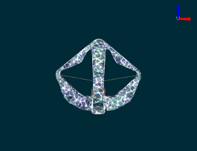

# soft-robot-control-ssmlearn

  

This repository contains the matlab code for "SSMLearn for Control". Currently, we are conducting modal analysis to sysID the diamond robot (see above)

To get started in Matlab, run ``install.m``. 
Go to the ``examples/`` folder and run ``analysis_mattia.mlx`` for minimal code setup to do modal analysis. This script does the following:

1. Imports mass matrix ``M_actual.csv``, stiffness matrix ``K_actual.csv``, and damping matrix ``C_actual.csv``. These matrices are evaluated at the equilibium configuration ``q_g`` (which is the resting position under influence of gravity).
2. Computes (undamped) modes of linear system corresponding to about system matrices
3. Loads (selected) modal displacements and decay trajectories
4. Visualizes decay trajectories on (selected) j-th modal 2-D subspace (e.g. ``j = 1: [\xi_1, \dot{\xi}_1]``).
5. OPTIONAL: View amplitudes of Figure 8 trajectory (REQUIRED: ``vq.csv`` from google drive).

Main (but cluttered) modal analysis file is located in ``modal_analysis.mlx`` in the root directory.
