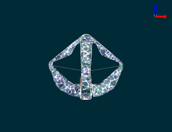

# SSMRc: Spectral Submanifold Reduction for Control of High-Dimensional Robots

This repository contains the code accompanying our recent ICRA paper: [Data-Driven Spectral Submanifold Reduction for Nonlinear Optimal Control of High-Dimensional Robots](https://arxiv.org/abs/2209.05712). We learn low-dimensional, faithful control dynamics of high degree-of-freedom (DOF) mechanical systems on attracting, invariant manifolds called Spectral Submanifolds [^1]. This work extends recent work on learning autonomous dynamics of nonlinearizable systems to the control setting.[^2] 

  

To get started in Matlab, run ``install.m``. 
Go to the ``examples/`` folder and run ``analysis_mattia.mlx`` for minimal code setup to do modal analysis. This script does the following:

1. Imports mass matrix ``M_actual.csv``, stiffness matrix ``K_actual.csv``, and damping matrix ``C_actual.csv``. These matrices are evaluated at the equilibium configuration ``q_g`` (which is the resting position under influence of gravity).
2. Computes (undamped) modes of linear system corresponding to about system matrices
3. Loads (selected) modal displacements and decay trajectories
4. Visualizes decay trajectories on (selected) j-th modal 2-D subspace (e.g. ``j = 1: [\xi_1, \dot{\xi}_1]``).
5. OPTIONAL: View amplitudes of Figure 8 trajectory (REQUIRED: ``vq.csv`` from google drive).

Main (but cluttered) modal analysis file is located in ``modal_analysis.mlx`` in the root directory.

<h3>All decay trajectories are located in modal_trajectory_data/decay/ folder. TODO: Reorganize file structure</h3>

[^1]: Haller, George, and Sten Ponsioen. "Nonlinear normal modes and spectral submanifolds: existence, uniqueness and use in model reduction." Nonlinear dynamics 86.3 (2016): 1493-1534.
[^2]: Cenedese, Mattia, et al. "Data-driven modeling and prediction of non-linearizable dynamics via spectral submanifolds." Nature communications 13.1 (2022): 1-13.
