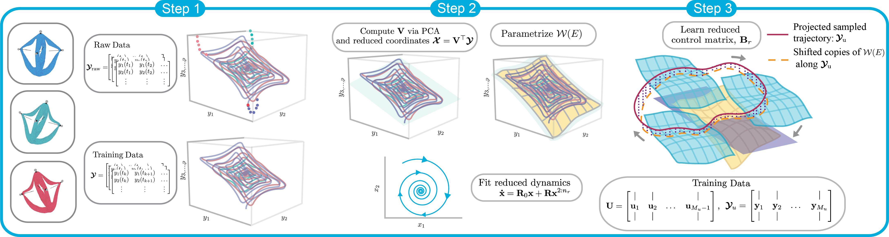

# SSMRc: Spectral Submanifold Reduction for Control of High-Dimensional Robots

This repository contains the code accompanying our recent ICRA paper: [Data-Driven Spectral Submanifold Reduction for Nonlinear Optimal Control of High-Dimensional Robots](https://arxiv.org/abs/2209.05712). We learn low-dimensional, faithful control dynamics of high degree-of-freedom (DOF) mechanical systems on attracting, invariant manifolds called Spectral Submanifolds [^1]. This work extends recent work on learning autonomous dynamics of nonlinearizable systems to the control setting.[^2] 

  

---

## Dependencies
- [SSMLearn](https://github.com/haller-group/SSMLearn): Repo has a stand-alone version installed in ``ext/`` folder. This could potentially be deprecated, so we recommend users to install the latest version.
- [Soft Robot Control](https://github.com/StanfordASL/soft-robot-control.git): Required to generate data from SOFA simulation of soft robots.

## Getting Started
- To get started, in Matlab run ``install.m``.
- Go to the ``ROM/`` folder and run ``generateSSMmodel.mlx`` to generate a discrete and continuous-time SSMRc model based on our dataset ``dataDecayObs``, which can be downloaded [here](https://drive.google.com/file/d/1Uxqvy-_id8Cq3RVgeilJa7a8WiGj4ich/view?usp=sharing).
- The generated model must then be imported into the ``examples/hardware/SSMmodels`` folder of the ``soft-robot-control`` [repo](https://github.com/StanfordASL/soft-robot-control.git). Follow the instructions on the corresponding repo to run the controller.

---

## Generating your own model

#### Step 1: Collect Training Data

  

- To parameterize the autonomous manifold, we must first collect ``decaying`` data trajectories from either a simulation environment (e.g., [SOFA](https://www.sofa-framework.org/download/) for soft robot applications) or from hardware experiments.
  - To use the ``consolidateSSMTrainData.m`` function (which consolidates the individual training data into appropriate matlab cell format), the individual training data must be saved as ``.mat`` files. See ``hw_train.mlx`` for working example.
- Once the individual raw trajectory files are consolidated into the appropriate cell format (i.e., cell column 1 := time, cell column 2 := decay trajectory), the transients from the dataset is truncated to ensure the training trajectories are near the invariant manifold. See ``ROM/generateSSMmodel.mlx``, ``ROM/mainObsCDS.mlx``, or ``ROM/mainObsDDS.mlx`` for an example.
- Below is a visual depiction of this process on our soft robot example. 

[^1]: Haller, George, and Sten Ponsioen. "Nonlinear normal modes and spectral submanifolds: existence, uniqueness and use in model reduction." Nonlinear dynamics 86.3 (2016): 1493-1534.
[^2]: Cenedese, Mattia, et al. "Data-driven modeling and prediction of non-linearizable dynamics via spectral submanifolds." Nature communications 13.1 (2022): 1-13.
